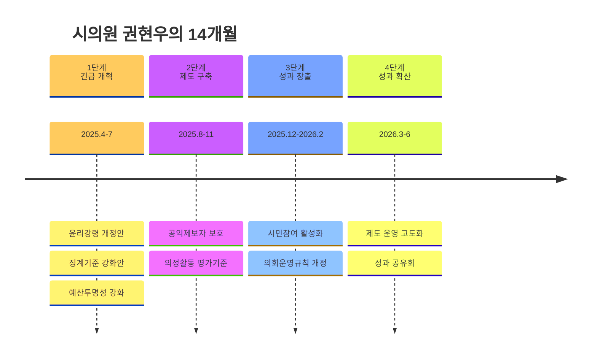

# 1년의 약속, 확실한 변화
> **모토: 기강 ON, 특권 OFF**

## 1. 시의회, 부끄러워서 살겠습니까?
- 돈은 마음대로 쓰고
- 비위는 마음대로 저질러도
- 아무런 벌칙도 없는 시의회
- 시민의 목소리는 외면하는 시의회
- 뭘 하는지 모르지만 뉴스에 나오면 부끄러운 소식뿐인 시의회

## 2. 견제와 감시, 이제는 제도로
### 시의회 책임성 강화
- 의원 윤리강령 위반시 실질적 제재 조례 제정
- 의정활동 불성실 및 비위행위 징계 기준 강화
- 의회 예산 사용 위반시 처벌 조항 신설

### 투명한 의정활동 실천
- 의정활동 실시간 공개
- 예산 심의 과정 상세 공개
- 주민 의견 청취 창구 상시 운영

## 3. 시민을 지키는 정치 하겠습니다
### 공익제보자 보호 제도화
- 공익제보자 보호 및 지원 조례 제정
- 제보자 신분 보장 및 불이익 방지

### 현장 중심 의정활동
- 주민 불편사항 즉각 해결
- 지역 현안 해결을 위한 협력

## 실천 서약
1. 의원 비위 근절과 징계 강화를 위한 조례 즉시 발의 (~2025. 7월)
2. 시의회 기강 확립을 위한 제도 정비 (~2025. 11월)
3. 시민과 소통하는 현장 중심 의정활동 (항상)

---
### **권현우가 약속드립니다**
### - 1년, 양산 시의회의 변화를 만들어내겠습니다

